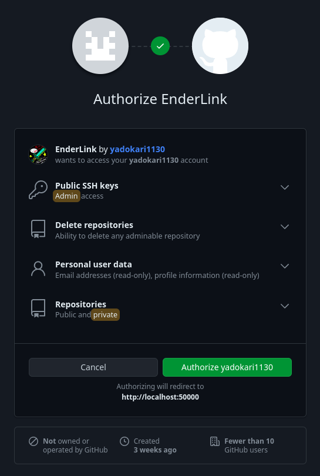

# EnderLink

# 特徴
## サーバーデータの同期・疑似24時間サーバー化
複数人でサーバーデータを同期することができます  
そのためサーバー参加者全員がサーバーを開くことができ、
サーバーを借りなくても擬似的に24時間サーバーにすることができます

## ポート開放不要機能
ポート開放をしなくてもサーバーを公開することができる、Ngrokとの連携機能がついています  
そのためポート開放なしで簡単にサーバーを公開することができます

## 自動バックアップ
サーバーの起動時・停止時に自動的にバックアップを取ります  
また好きなタイミングでバックアップを取ることもできます  
さらに、取ったバックアップまで簡単に戻すことができます

# ダウンロード
## [https://github.com/yadokari1130/EnderLink/releases](https://github.com/yadokari1130/EnderLink/releases)

# インストール
ダウンロードした`EnderLink-Installer-x.x.x.exe`(`x.x.x`はバージョン)をダブルクリックし、インストールします  
インストーラーを実行すると以下のような画面が出る場合があります  
これは認証を受けていないアプリケーションに対する警告画面ですが、「詳細情報」をクリックし、右下の「実行」を押すことでインストールすることができます
(認証は有料のため現在は行っておりません)

# 使い方
## Gitインストール
Gitはデータの管理を行うためのアプリケーションです  
「[Gitのインストール方法(Windows版)](https://qiita.com/T-H9703EnAc/items/4fbe6593d42f9a844b1c)」
このサイトなどを参考に、Gitをインストールしてください  
EnderLinkを開いている場合は一度閉じ、インストールを行ってください

## GitHubログイン
データの共有には無料のGitHubアカウントが必要です  
「GitHub」はMinecraftの開発元と同じ企業のMicrosoftが運営する、主にプログラムなどのデータを複数人で共有することができるサービスです   
「[1分もかからない！5ステップでGitHubアカウント作成](https://reffect.co.jp/html/create_github_account_first_time)」
このサイトなどを参考に、GitHubアカウントを作成してください  
質問は自由に答えてもらってかまいませんが、よくわからないという方はチームメンバーの数は「Just me」、先生か生徒かは「Student」、興味がある機能は「Collaborative coding」 を選択してください 
プランは無料プランであるFreeを選択してください  

アカウントが作成できたら、画面左のタブから「基本設定」画面を開きます  
「GitHubでログイン」ボタンをクリックすると、以下のような画面がブラウザで開かれるので、右下の「Authorize (ユーザー名)」をクリックし、
連携を許可します
  
ログインが正しく行われた場合、以下のようにアカウント情報が表示されます

## SSHキー登録
GitHubとデータのやり取りをするためにはSSHキーの登録が必要です  
「SSHキーを登録」ボタンを押すことで自動的にSSHキーの生成・登録が行われます  
このアプリ専用のSSHキーを発行するため、すでにSSHキーを登録している場合でも新しく登録してください

## ポート開放不要機能の設定
