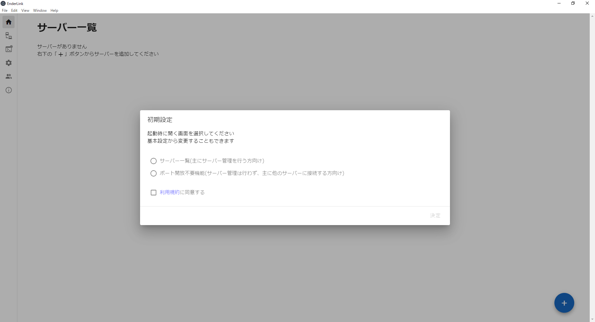

<!-- omit in toc -->
# EnderLink

# 特徴
## サーバーデータの同期・疑似24時間サーバー化
複数人でサーバーデータを同期することができます  
そのためサーバー参加者全員がサーバーを開くことができ、
サーバーを借りなくても擬似的に24時間サーバーにすることができます

## ポート開放不要機能
ポート開放をしなくてもサーバーを公開することができる、Ngrokとの連携機能がついています  
そのためポート開放なしで簡単にサーバーを公開することができます

## サーバー作成機能
バージョン1.18以降のバニラサーバーを自動でダウンロードし、簡単に新しいサーバーを作成することができます

## 自動バックアップ
サーバーの起動時・停止時に自動的にバックアップを取ります  
また好きなタイミングでバックアップを取ることもできます  
さらに、取ったバックアップまで簡単に戻すことができます

# 注意
## 利用規約
使用する前に[利用規約](https://github.com/yadokari1130/EnderLink/blob/master/LICENSE)を読み、同意してください
## サポート環境
本アプリケーションは基本的にどのクライアントでも動作するように開発を行っています  
しかしModやプラグインの組み合わせによっては正常に動作しない可能性があり、全てに対応することは不可能なため、バニラサーバーのみをサポートさせて頂きます  
そのためバニラサーバー以外で起きた問題については対応できない場合がありますが、ご了承下さい
## 質問など
質問や不具合報告は以下で受け付けています  
Twitter: [Y4D0K4R1](https://x.com/Y4D0K4R1)(DMも受け付けています)  
GitHub: [Issue](https://github.com/yadokari1130/EnderLink/issues)
> [!IMPORTANT]  
> 質問の際はできるだけ詳しい情報を書くようにお願いします  
> 必須項目
> - EnderLinkのバージョン(アプリ情報から確認できます)
> - Minecraftのバージョン(「バニラ1.20」、「Forge 1.20 - 46.0.14」など)
> - アプリケーションのログ(Ctrl + shift + Iでログ画面が表示されるので、スクリーンショットを撮り、個人情報などが映っている場合は隠して送ってください)
> - どのような操作をしたか(何をしようとして、何のボタンを押したかなど)
>
> 追加の情報をお願いすることもありますが、情報がないと解決できないため、ご協力お願いします

# 目次
- [ダウンロード](#ダウンロード)
  - [https://github.com/yadokari1130/EnderLink/releases](#httpsgithubcomyadokari1130enderlinkreleases)
- [インストール](#インストール)
- [インストール後の初期設定](#インストール後の初期設定)
  - [初期ページの設定](#初期ページの設定)
  - [Gitのインストール](#gitのインストール)
  - [Javaのインストール](#javaのインストール)
  - [GitHubログイン](#githubログイン)
  - [SSHキー登録](#sshキー登録)
  - [Cloudflare Tunnelのインストール(ポート開放不要機能)](#cloudflare-tunnelのインストールポート開放不要機能)
- [サーバー作成](#サーバー作成)
  - [新しくサーバーを作成する](#新しくサーバーを作成する)
  - [PCからインポートする](#pcからインポートする)
  - [GitHubからインポート](#githubからインポート)
- [サーバー設定](#サーバー設定)
  - [基本設定タブ](#基本設定タブ)
  - [プロパティタブ](#プロパティタブ)
  - [ワールド・データパックタブ](#ワールドデータパックタブ)
  - [ホワイトリスト・OP権限タブ](#ホワイトリストop権限タブ)
- [Cloudflare Tunnel(ポート開放不要機能)](#cloudflare-tunnelポート開放不要機能)
  - [他のサーバーに接続](#他のサーバーに接続)
  - [Cloudflare Tunnel](#cloudflare-tunnel)
- [起動中のサーバー](#起動中のサーバー)
  - [サーバー名](#サーバー名-2)
  - [状態](#状態)
  - [サーバーアドレス](#サーバーアドレス)
  - [サーバーログ](#サーバーログ)
  - [強制終了](#強制終了)
- [基本設定](#基本設定)
  - [GitHub](#github)
  - [アプリケーション設定](#アプリケーション設定)
- [招待されたサーバー](#招待されたサーバー)
  - [サーバー一覧](#サーバー一覧)
  - [招待を受け入れたサーバーをダウンロードする](#招待を受け入れたサーバーをダウンロードする)

# ダウンロード
## [https://github.com/yadokari1130/EnderLink/releases](https://github.com/yadokari1130/EnderLink/releases)

# インストール
ダウンロードした`EnderLink-Installer-x.x.x.exe`(`x.x.x`はバージョン)をダブルクリックし、インストールします  
インストーラーを実行すると以下のような画面が出る場合があります  
これは認証を受けていないアプリケーションに対する警告画面ですが、「詳細情報」をクリックし、右下の「実行」を押すことでインストールすることができます
(認証は有料のため現在は行っておりません)

# インストール後の初期設定
## 初期ページの設定
初回起動後、以下のような画面が表示されます  
  
主にサーバーの管理を行う方はサーバー一覧を、  
サーバー管理は行わず、主に他のサーバーに接続する方はポート開放不要機能を選択してください

また、[利用規約](https://github.com/yadokari1130/EnderLink/blob/master/LICENSE)を読み、同意してください

## Gitのインストール
Gitはデータの管理を行うためのアプリケーションです  
「インストール済み」と表示されている場合は再度インストールする必要はありません
### Windows
基本設定からGitのインストールを行うことができます  
画面にログが流れますが、規約への同意が求められる場合があるため、指示に従って入力してください

## Javaのインストール
JavaはMinecraftサーバーを起動するためのアプリケーションです  
「インストール済み」と表示されている場合は再度インストールする必要はありません
### Windows
基本設定からJavaのインストールを行うことができます  
「インストールするバージョンを切り替え」にチェックを入れることでインストールするバージョンを選択できますが、バニラで遊ぶ場合はバージョンを変更する必要はありません  
Forgeなどで遊ぶ場合はバージョンによっては正常に起動しない場合があるため、Forgeのバージョンに合わせてインストールしてください  
画面にログが流れますが、規約への同意が求められる場合があるため、指示に従って入力してください

[//]: # (### Mac OS、Linux)
[//]: # (パッケージマネージャー&#40;homebrewやaptなど&#41;を用いてインストールを行ってください  )
[//]: # (EnderLinkを起動している場合はインストール後にEnderLinkの再起動を行ってください)

## GitHubログイン
サーバーを起動するためには無料のGitHubアカウントが必要です  
> [!IMPORTANT]
> 「GitHub」はMinecraftの開発元と同じ企業のMicrosoftが運営する、主にプログラムなどのデータを複数人で共有することができるサービスです   
> **サーバーデータは基本的にGitHubにアップロードされますが、招待したユーザー以外の人に公開されることはありません**  

「[1分もかからない！5ステップでGitHubアカウント作成](https://reffect.co.jp/html/create_github_account_first_time)」
このサイトなどを参考に、GitHubアカウントを作成してください  
質問は自由に答えてもらってかまいませんが、よくわからないという方はチームメンバーの数は「Just me」、先生か生徒かは「Student」、興味がある機能は「Collaborative coding」 を選択してください  
プランは無料プランであるFreeを選択してください

アカウントが作成できたら、画面左のタブから「基本設定」画面を開きます  
「GitHubでログイン」ボタンをクリックすると、以下のような画面がブラウザで開かれるので、右下の「Authorize (ユーザー名)」をクリックし、
連携を許可します  
  
ログインが正しく行われた場合、以下のようにアカウント情報が表示されます

## SSHキー登録
サーバーを起動するためにはSSHキーの登録が必要です  
「SSHキーを登録」ボタンを押すことで自動的にSSHキーの生成・登録が行われます  
このアプリ専用のSSHキーを発行するため、すでにSSHキーを登録している場合でも新しく登録してください

## Cloudflare Tunnelのインストール(ポート開放不要機能)
Cloudflare Tunnelというサービスを利用することで、ポート開放をすることなくサーバーを公開することができます  
使用しているOSに関わらず、Cloudflare Tunnel画面から「cloudflare Tunnelのインストール」をクリックし、インストールを行ってください  
インストール中の操作は不要です

# サーバー作成
## 新しくサーバーを作成する
1.18以上のバニラサーバーはアプリ内から作成することができます  
それ以外のサーバーは手動で作成し、[PCからインポートする](#PCからインポートする)を参考にEnderLinkに取り込んでください  
画面下部の「＋」ボタンを押すとサーバー作成ダイアログが表示されるので、必要な情報を入力していきます
### サーバー名
好きな名前を入力してください  
以前使用した名前は使えません  
名前は2文字以上255文字以下かつ、半角英数字・アンダーバー・ハイフンのみが使えます  
### バージョン
Minecraftのバージョンを選択してください
### ワールド
すでにあるワールドを指定することができます  
指定しない場合、新しいワールドが生成されます
#### シングルワールドを選択
ボタンを押すと、シングルで遊んでいたワールドの一覧が表示されるので、指定したいワールドを押して選択してください
表示されるワールドは`.minecraft/saves`の中にあるもののみです
#### ワールドフォルダを選択
シングルで遊んでいたワールド以外のワールドを指定することができます  
配布ワールドなどを指定して遊ぶことができます  
圧縮されているものは解凍してから選択してください
### 保存先のフォルダを選択
サーバーデータを保存するフォルダを選択してください  
実際に保存されるのは`{指定したフォルダ}/{サーバー名}`です
### 最大メモリ
サーバーに使える最大のメモリ量を選択します  
使っているPCのスペックに合わせて選択してください
### 最小メモリ
サーバーに使える最小のメモリ量を選択します  
使っているPCのスペックに合わせて選択してください
### 詳細なオプション
#### Javaのパスの指定
サーバーを起動する際のJavaのパスを指定します  
指定していなかった場合、自動検出されたJavaが使用されます  
Javaの最新バージョンがインストールされている状態でバニラのサーバーを起動する場合、基本的に変更する必要はありません
#### JVMの引数
サーバー起動時に適用するJVMの引数を設定します  
メモリは上記の設定が適用されるため、指定する必要はありません
### 利用規約に同意
Minecraftの利用規約を読み、同意してください  
EnderLinkの利用規約ではありません
### 追加
設定があっていることを確認し、右下の追加ボタンを押すことでサーバーの作成が始まります  
ネットワークの状況等により、時間がかかることがありますが、しばらくお待ちください

## PCからインポートする
すでにパソコン上にあるサーバーをEnderLinkに取り込み、管理を行います  
「＋」ボタンを押したあと、「PCからインポート」タブを押し、必要な情報を入力していきます
### サーバー名
好きな名前を入力してください  
以前使用した名前は使えません  
名前は2文字以上255文字以下かつ、半角英数字・アンダーバー・ハイフンのみが使えます
### サーバーフォルダを選択
インポートするサーバーフォルダを選択してください
### 最大メモリ
サーバーに使える最大のメモリ量を選択します  
使っているPCのスペックに合わせて選択してください
### 最小メモリ
サーバーに使える最小のメモリ量を選択します  
使っているPCのスペックに合わせて選択してください
### jarを選択
サーバーのjarファイルを選択します
### 詳細なオプション
#### Javaのパスの指定
サーバーを起動する際のJavaのパスを指定します  
指定していなかった場合、自動検出されたJavaが使用されます  
Javaの最新バージョンがインストールされている状態でバニラのサーバーを起動する場合、基本的に変更する必要はありません
#### JVMの引数
サーバー起動時に適用するJVMの引数を設定します  
メモリは上記の設定が適用されるため、指定する必要はありません
### 追加
設定があっていることを確認し、右下の追加ボタンを押すことでサーバーの作成が始まります  
ネットワークの状況等により、時間がかかることがありますが、しばらくお待ちください

## GitHubからインポート
他の人が作成したサーバーをダウンロードし、EnderLinkで管理を行います  
「＋」ボタンを押したあと、「GitHubからインポート」タブを押し、必要な情報を入力していきます  
なお、ダウンロードができるのは招待を受け、受諾したサーバーのみです
### サーバー
ダウンロードしたいサーバーを一覧から選択してください  
一覧に表示されている名前は`{サーバー作成者}/{サーバー名}`というようになっています
### 保存先のフォルダを選択
サーバーデータを保存するフォルダを選択してください  
実際に保存されるのは`{指定したフォルダ}/{サーバー名}`です
### 最大メモリ
サーバーに使える最大のメモリ量を選択します  
使っているPCのスペックに合わせて選択してください
### 最小メモリ
サーバーに使える最小のメモリ量を選択します  
使っているPCのスペックに合わせて選択してください
### jarを選択
サーバーのjarファイルを選択します
### 詳細なオプション
#### Javaのパスの指定
サーバーを起動する際のJavaのパスを指定します  
指定していなかった場合、自動検出されたJavaが使用されます  
Javaの最新バージョンがインストールされている状態でバニラのサーバーを起動する場合、基本的に変更する必要はありません
#### JVMの引数
サーバー起動時に適用するJVMの引数を設定します  
メモリは上記の設定が適用されるため、指定する必要はありません
### 追加
設定があっていることを確認し、右下の追加ボタンを押すことでサーバーの作成が始まります  
ネットワークの状況等により、時間がかかることがありますが、しばらくお待ちください

# サーバー設定
サーバー一覧から「設定」ボタンを押すことでサーバーの設定を行うことができます
## 基本設定タブ
### 起動
起動ボタンを押すことでサーバーを起動することができます
### 停止済みにする
アプリが正常に終了しなかった場合など、サーバーが停止しているにも関わらず、
サーバーが起動している状態になってしまうことがあります  
その場合に正しい情報に更新します
### 最大メモリ
サーバーに使える最大のメモリ量を選択します  
使っているPCのスペックに合わせて選択してください
### 最小メモリ
サーバーに使える最小のメモリ量を選択します  
使っているPCのスペックに合わせて選択してください
### jarを選択
サーバーのjarファイルを選択します
### 詳細なオプション
#### Javaのパスの指定
サーバーを起動する際のJavaのパスを指定します  
指定していなかった場合、自動検出されたJavaが使用されます  
Javaの最新バージョンがインストールされている状態でバニラのサーバーを起動する場合、基本的に変更する必要はありません
#### JVMの引数
サーバー起動時に適用するJVMの引数を設定します  
メモリは上記の設定が適用されるため、指定する必要はありません
### サーバーアイコンを選択
Minecraft内で表示されるサーバーアイコンを設定します  
自動的に64x64のpngに変換されます
正方形でない場合は白い帯が追加されるので、できるだけ正方形のものを選択することをおすすめします
### サーバーアイコンを削除
今あるサーバーアイコンを削除します
### 保存
設定を保存し、更新します  
設定を変更しただけでは保存されないので、必ず保存ボタンを押してください
### データをアップロード
データに矛盾がない場合、サーバーのデータをGitHubにアップロードします  
サーバーの起動・終了時、設定の更新時などに自動でアップロードされるため、基本的に操作を行う必要はありません
### データをダウンロード
データに矛盾がない場合、サーバーのデータをGitHubからダウンロードします
### データを強制的にアップロード
GitHubのデータをパソコンのデータで強制的に上書きします  
**他の参加者全員が強制的にダウンロードする必要があります**  
**なにか問題が起きているときのみアップロードしてください**
### データを強制的にダウンロード
パソコンのデータをGitHubのデータで強制的に上書きします  
**保存していないデータは失われます**  
**なにか問題が起きているときのみダウンロードしてください**

### バックアップ一覧
バックアップの一覧です  
バックアップを行ったユーザー、バックアップを取った時間、バックアップの内容を確認することができます  
「戻す」ボタンを押すことでそのバックアップに戻すことができます

### サーバー管理者一覧
サーバーデータにアクセスすることができるユーザーの一覧です  
> [!IMPORTANT]
> Minecraft内からのアクセスとは関係ありません  
> データを閲覧できないだけであり、ホワイトリストを設定していない限り誰でも接続することができます
#### ユーザー追加
GitHubのユーザー名を入力し、「ユーザー追加」ボタンを押すことでそのユーザーに招待が送られます  
その後、招待されたユーザーが招待を受け入れることでサーバーデータにアクセスすることができるようになります  
招待されたユーザーは[招待されたサーバー](#招待されたサーバー)を参考に、招待を受け入れてください  
なお、招待が表示されるまでにしばらく時間がかかる可能性があります
> [!CAUTION]
> 必ず信頼できる人のみ招待してください  
> 荒らしたり、悪意のあるファイルなどをアップロードすることが可能になります  
> また、サーバーに招待された人が別の人を招待することもできます  
> そのため、信頼できない人は招待しないでください
#### 削除
ユーザー名の右側にある、「削除」ボタンを押すことでそのユーザーのアクセス権を削除することができます  
なお、アクセス権を削除すると今後データにアクセスすることはできなくなりますが
**そのユーザーのパソコン上に保存されているデータは削除されずに残ります**

### パソコンから削除
パソコン上にあるデータを削除します  
GitHub上にはデータが残るため、再度[GitHubからインポート](#GitHubからインポート)を行うことで
ダウンロードすることができます

### GitHubから削除
パソコンからもGitHubからもデータを削除します  
**データが完全に消去され、もとに戻ることはありません**
> [!CAUTION]
> 本当にデータが完全に消去されても良いかしっかりと確認してから削除してください

## プロパティタブ
`server.properties`の内容を変更します  
上部の検索欄にプロパティ名を入力することで絞り込みを行うことができます

## ワールド・データパックタブ
### シングルワールドを選択
ボタンを押すと、シングルで遊んでいたワールドの一覧が表示されるので、指定したいワールドを押して選択してください
表示されるワールドは`.minecraft/saves`の中にあるもののみです
### ワールドフォルダを選択
シングルで遊んでいたワールド以外のワールドを指定することができます  
配布ワールドなどを指定して遊ぶことができます  
圧縮されているものは解凍してから選択してください
### データパックの保持
元々入っていたデータパック・選択したワールドに入っていたデータパックを保持するかを選択してください
### ワールドを変更
「ワールドを変更」ボタンを押すことでそのワールドに変更することができます  
元々あったワールドデータは消去されますが、[バックアップ一覧](#バックアップ一覧)から元に戻すことができます

### zip形式のデータパックを選択
zip形式のデータパックを選択することでデータパック一覧に追加されます  
選択したデータパックは青色で表示され、「データパックを適用」ボタンを押すまでは実際に追加されることはありません
### フォルダ形式のデータパックを選択
フォルダ形式のデータパックを選択することでデータパック一覧に追加されます  
zip形式と同様に適用するまでは実際に追加されることはありません
### データパックを削除
データパックの右側にあるゴミ箱アイコンを押すことでデータパックを削除することができます  
ゴミ箱アイコンを押したデータパックは赤色で表示され、「データパックを適用」ボタンを押すまでは実際に削除されることはありません  
また、赤色になったデータパックの右側には矢印アイコンが表示され、この矢印アイコンを押すことによって削除を取り消すことができます
### データパックを適用
追加、削除したデータパックを実際に適用します  
削除したデータパックはフォルダからも削除されます

## ホワイトリスト・OP権限タブ
### ホワイトリスト
[プロパティ](#プロパティタブ)から`white-list`をオンにしていない場合はホワイトリストが適用されず、
誰でもサーバーに入ることができます
#### プレイヤーを追加
プレイヤー名を入力し、「追加」ボタンを押すことでホワイトリストにプレイヤーを追加することができます
#### プレイヤーを削除
プレイヤーの右側にあるゴミ箱アイコンを押すことでプレイヤーをホワイトリストから削除することができます  
ゴミ箱アイコンを押したプレイヤーは赤色で表示され、「保存」ボタンを押すまでは実際に削除されることはありません  
また、赤色になったプレイヤーの右側には矢印アイコンが表示され、この矢印アイコンを押すことで削除を取り消すことができます  
#### 保存
追加、削除したプレイヤーを実際に適用します

### OP権限
#### プレイヤーを追加
プレイヤー名を入力し、「追加」ボタンを押すことでホワイトリストにプレイヤーを追加することができます
#### 権限レベル
プレイヤーの右側にある入力欄から権限レベルを設定することができます  
権限レベルについては[https://minecraft.fandom.com/ja/wiki/権限レベル#効果](https://minecraft.fandom.com/ja/wiki/%E6%A8%A9%E9%99%90%E3%83%AC%E3%83%99%E3%83%AB#%E5%8A%B9%E6%9E%9C)からご覧ください
#### プレイヤーを削除
プレイヤーの右側にあるゴミ箱アイコンを押すことでプレイヤーをホワイトリストから削除することができます  
ゴミ箱アイコンを押したプレイヤーは赤色で表示され、「保存」ボタンを押すまでは実際に削除されることはありません  
また、赤色になったプレイヤーの右側には矢印アイコンが表示され、この矢印アイコンを押すことで削除を取り消すことができます
#### 保存
追加、削除したプレイヤーを実際に適用します

# Cloudflare Tunnel(ポート開放不要機能)
## 他のサーバーに接続
使い方は[Cloudflare Tunnelの使い方](/CONNECT_CLOUDFLARE_TUNNEL.md)をご覧ください
## Cloudflare Tunnel
### Cloudflare Tunnelを使う
チェックマークをつけた場合、ポート開放をしなくてもサーバーに接続することができるサーバーアドレスが発行されます  
サーバー参加者がサーバーに参加する場合、このアドレスを[Cloudflare Tunnelの使い方](/CONNECT_CLOUDFLARE_TUNNEL.md)を参考に入力し、
Minecraft内で`localhost`に接続することでサーバーに参加することができます
### Cloudflare Tunnelをインストール
ポート開放不要機能に必要なツールをインストールします  
使用しているOSに関わらず、「cloudflare Tunnelのインストール」をクリックし、インストールを行ってください  
インストール中の操作は不要です
### Cloudflare Tunnelをアップデート
Cloudflare Tunnelがインストールされている場合、アップデートを行います  
バージョンはアップデートボタン上部に表示されています

# 起動中のサーバー
サーバーを起動後、この画面に遷移します  
> [!TIP]
> 他の画面に移動してもサーバーは動き続けますが、一度に起動することができるサーバーは一つのみです
## サーバー名
画面上部に現在起動中のサーバー名、サーバーアイコンが表示されています
## 状態
サーバーの状態が表示されます
## サーバーアドレス
サーバーに接続するするためのアドレスが表示されます  
コピーアイコンを押すことでサーバーアドレスをコピーすることができます
また、「ツイートする」ボタンでサーバーアドレスをツイートすることもできます
## サーバーログ
サーバーのログが表示されます  
サーバーログ下部にあるテキストボックスにコマンドを入力し、エンターを押すことでコマンドを実行することができます  
サーバーを終了させる際にはここに「stop」と打ち込み、コマンドを実行してください
## 強制終了
サーバーを強制終了させます  
強制終了させた場合、正常にセーブが行われない可能性があります  
そのため、サーバーを終了させるためには最初に「stop」コマンドを実行し、しばらく待っても終了しない場合のみ、強制終了を行ってください

# 基本設定
## GitHub
### GitHubでログイン
サーバーを起動するためにはログインを行う必要があります  
[GitHubログイン](#githubログイン)を参考にログインを行ってください
### ログイン中のユーザー
正常にログインできた場合、現在ログインしているユーザーのユーザー名、メールアドレス、アイコンが表示されます  
### SSHキーを登録
サーバーを起動するためにはSSHキーの登録を行う必要があります  
[SSHキー登録](#sshキー登録)を参考にSSHキーの登録を行ってください
### ログアウト
GitHubからログアウトします
### Git
Gitはデータの管理を行うためのアプリケーションです  
[Gitのインストール](#gitのインストール)を参考にGitのインストールを行ってください

## アプリケーション設定
### 初期ページ
EnderLinkを開いたときに最初に表示するページを変更します  
主にサーバーの管理を行う方はサーバー一覧を、  
サーバー管理は行わず、主に他のサーバーに接続する方はポート開放不要機能を選択してください

# 招待されたサーバー
招待を受けたサーバーの一覧を見ることができます  
サーバーに招待したい場合、[ユーザー追加](#ユーザー追加)を参考に招待を行ってください  
なお、招待が表示されるまでにしばらく時間がかかる可能性があります
## サーバー一覧
### サーバー名
招待を受けたサーバー名です
### 所有者
サーバーの所有者です
### 招待者
サーバーに招待したユーザーです
### 招待日
招待を送った日です
### 操作
チェックマークを押すことで、招待を受け入れることができます  
バツマークを押すことで、招待を拒否することができます
## 招待を受け入れたサーバーをダウンロードする
招待を受け入れた場合、サーバーのデータにアクセスすることができるようになります  
[GitHubからインポート](#githubからインポート)を参考に、サーバーを追加してください